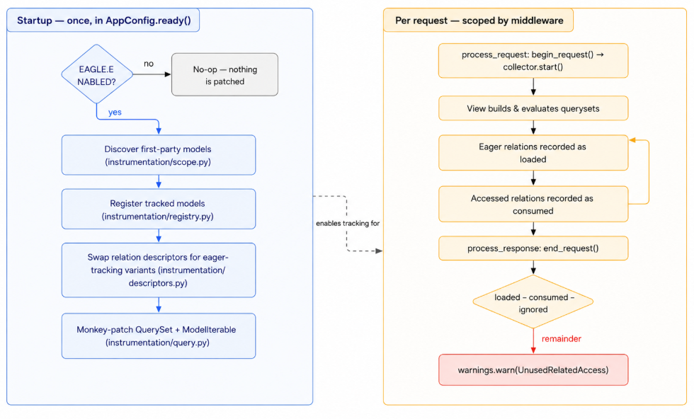
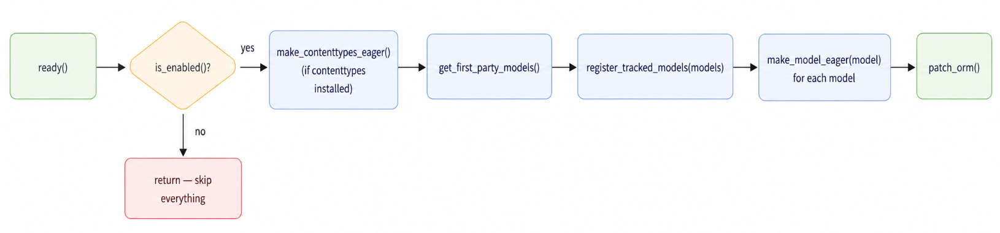
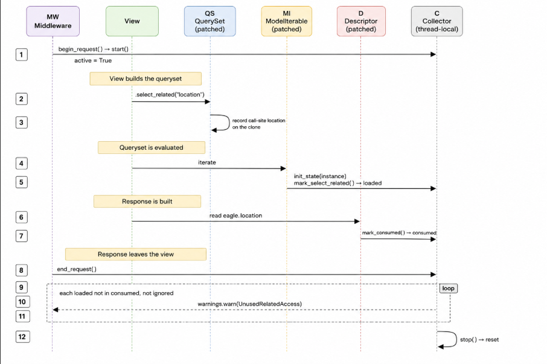
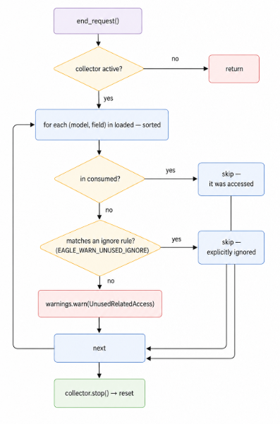
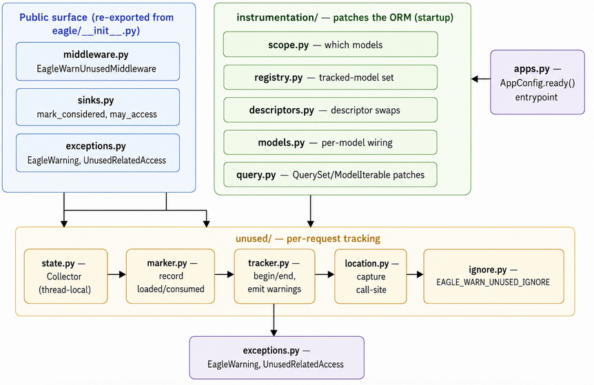

# Architecture

How `django-eagle` works under the hood: the moving parts, how they fit together,
and the path a request takes from "queryset built" to "warning emitted".

If you just want to *use* eagle, the [README](README.md) is enough. This document is
for contributors and the curious — read it when you want to change eagle's internals
or understand why a warning did (or didn't) fire.

## The core idea

Eagle answers one question per request: **which eager-loaded relations were never read?**

It tracks two sets of relations:

- **Loaded** — every relation pulled in by `select_related` / `prefetch_related` when a
  queryset was evaluated.
- **Consumed** — every loaded relation that was actually accessed during the request.

At the end of the request, anything in `loaded` but not in `consumed` (and not
explicitly ignored) was wasted work, so eagle emits an `UnusedRelatedAccess` warning
for it.

```
unused = loaded − consumed − ignored
```

Everything else in this document is mechanism in service of computing those two sets
accurately.

## Two phases

Eagle operates in two distinct phases: a one-time **startup** phase that instruments
Django's ORM, and a **per-request** phase that records loads/accesses and emits warnings.



The two phases are decoupled: instrumentation makes the ORM *capable* of tracking, but
nothing is actually recorded unless the middleware has opened a request scope. Outside a
request (management commands, the shell, tests without the middleware) the patched code
checks `collector.active` / `_state.warn_unused` and quietly does nothing.

## Phase 1 — Startup instrumentation

Entry point: `EagleAppConfig.ready()` in `eagle/apps.py`. Django calls this once, after
every app's models are loaded. The flow:



### Deciding what to instrument (`instrumentation/scope.py`)

Eagle only instruments code you own, so warnings only point at relations you can fix.
`get_first_party_models()` walks every installed app and applies these rules:

- **First-party apps** — apps whose filesystem path is *not* under any dependency root
  (`site-packages`, stdlib, install schemes from `sysconfig`). Instrumented by default.
- **Third-party apps** — anything under a dependency root. Skipped, *unless* the app's
  dotted module name matches an entry in `EAGLE_THIRD_PARTY_INCLUDE_APPS` (for shared
  models libraries shipped as packages).
- **`EAGLE_EXCLUDE_APPS`** — overrides both; a listed app is never instrumented.

Proxy models are skipped (they share the concrete model's descriptors). The resulting
model classes are stored in a module-level set by `register_tracked_models`; the rest of
eagle calls `is_instrumented(model)` to decide whether to record anything for a given
model.

### Patching relation descriptors (`instrumentation/descriptors.py`)

Django exposes related fields through *descriptors* — the objects behind
`eagle.location`, `eagle.previous_locations`, etc. Eagle replaces each one with a
tracking variant. `make_model_eager(model)` (in `instrumentation/models.py`) walks the
model's fields, forward and reverse, and calls `make_descriptor_eager_inplace` on each
descriptor.

The instrumentation is an **in-place class swap**, not an instance wrapper:

```python
# Compose a new class: (EagleMixin, OriginalDescriptorClass)
composed = type(f"Eager{current.__name__}", (mixin, current), {"_eagle_eager": True})
descriptor.__class__ = composed
```

Composing on top of the descriptor's *current* class (rather than the stock Django
class) is deliberate: it means eagle layers cleanly over libraries that have already
patched the same descriptors. This is why ordering matters in `INSTALLED_APPS` — list
`eagle` **below** something like [django-seal](https://github.com/charettes/django-seal)
so eagle wraps the already-patched descriptor. The composition is cached per class and
guarded by `_eagle_eager`, so it's idempotent.

Each descriptor type gets a mixin tuned to how that relation is read:

| Relation kind | Descriptor | Mixin | Tracks |
| --- | --- | --- | --- |
| Forward FK | `ForwardManyToOneDescriptor` | `EagerForwardManyToOneMixin` | access via `__get__` |
| Forward O2O | `ForwardOneToOneDescriptor` | `EagerForwardOneToOneMixin` | access + prefetch |
| Reverse O2O | `ReverseOneToOneDescriptor` | `EagerReverseOneToOneMixin` | access + prefetch |
| M2M | `ManyToManyDescriptor` | `EagerRelatedManagerMixin` | prefetch (via related manager) |
| Reverse FK | `ReverseManyToOneDescriptor` | `EagerRelatedManagerMixin` | prefetch (via related manager) |
| Generic FK | `GenericForeignKey` | `EagerGenericForeignKeyMixin` | access + prefetch |

`make_model_eager` also installs `PrefetchCacheDescriptor` on the model, which intercepts
writes to `_prefetched_objects_cache` and wraps the dict in a `TrackingPrefetchCache` so
reads of the cache are observable.

### Patching the query layer (`instrumentation/query.py`)

`patch_orm()` monkey-patches a handful of Django internals (once, guarded by
`_eagle_patched`):

- `QuerySet.select_related` / `QuerySet.prefetch_related` — wrapped to record the
  **call-site location** (`file:line`) on the cloned queryset.
- `QuerySet._clone` — wrapped to carry those location tags across clones.
- `ModelIterable.__iter__` — wrapped to initialise per-instance tracking state and mark
  `select_related` relations as loaded as rows are materialised.
- `prefetch_one_level` — wrapped to swap prefetch result lists for `TrackedPrefetchList`.

## Phase 2 — Per-request lifecycle

`EagleWarnUnusedMiddleware` opens and closes a tracking scope around each request.
Everything recorded in between lands in a thread-local `Collector`.



### Recording loads

A relation is recorded as **loaded** when the queryset is *evaluated*, not when
`select_related` / `prefetch_related` is called:

- **select_related** — `ModelIterable.__iter__` (patched) checks the query's
  `select_related` map, builds getters for each cached field, and calls
  `mark_select_related` while walking each materialised instance and its nested
  relations. It also calls `init_state` to flag each instance's `_state` for tracking.
- **prefetch_related** — the patched descriptors' `get_prefetch_queryset(s)` call
  `mark_prefetched` for the parent instances as the prefetch executes.

### Recording accesses

A loaded relation becomes **consumed** the moment user code reads it:

- **Forward/reverse FK & O2O** — the descriptor's `__get__` calls `mark_consumed`, but
  only if the relation was actually cached (`is_cached(instance)`). A lazy database fetch
  isn't a "consumed eager load", so it's ignored.
- **Prefetched collections** — reads are caught in a few places: `TrackedPrefetchList`
  (whose `__iter__`, `__len__`, `__getitem__`, etc. mark consumption on first touch),
  `TrackingPrefetchCache.__getitem__`, and the eager related manager's `get_queryset`.

Because these hooks sit on ordinary attribute access, anything that reads a relation
counts — template rendering, DRF serializers, plain Python. That breadth is also the
source of false positives: a relation read only on *some* code paths looks unused on a
request that didn't take that path. See the README's
[false-positives section](README.md#suppressing-false-positives) for the escape hatches
(`mark_considered`, `may_access`, `EAGLE_WARN_UNUSED_IGNORE`).

### Tracking call-site locations

So a warning can point at the line that built the wasteful queryset, eagle captures a
`file:line` location (`unused/location.py` walks the stack for the first frame outside
eagle and Django). Locations live in two places and flow downward:

- **On the queryset** — `_eagle_location` (queryset-level) and `_eagle_locations` (a
  per-field map), attached when `select_related` / `prefetch_related` runs and copied
  across `_clone`.
- **On the instance `_state`** — `init_state` copies them onto each materialised instance;
  prefetches propagate the tag to child querysets via `propagate_prefetch_location`.

`resolve_location` prefers the most specific per-field location, falling back to the
queryset-level one.

## The collector — per-request state

All tracking state lives in a single thread-local `Collector` (`unused/state.py`):

```python
class Collector(threading.local):
    active: bool                                  # is a request being tracked?
    loaded: dict[(model_name, cache_name), LoadedRelation]   # kind + call-site
    consumed: set[(model_name, cache_name)]       # relations that were accessed
```

- **Thread-local** because Django serves each sync request on its own thread; per-thread
  state keeps concurrent requests from contaminating each other.
- **Keyed by `(model_name, cache_name)`** — model *name* (not class) and the ORM cache key
  for the relation. This is why `mark_considered` accepts a model name string.
- **First write wins** for `loaded`, so the originally captured call-site survives repeated
  loads.

`begin_request()` resets and activates it; `end_request()` reconciles and deactivates it.

## Emitting warnings

`end_request()` (`unused/tracker.py`) reconciles the two sets and emits one warning per
surviving relation:



Ignore rules (`unused/ignore.py`) are matched at emit time: a rule matches when every key
it specifies (`model`, `field`, `location`) matches, where `location` is an `fnmatch`
glob against the captured `file:line`. A partial or empty rule matches broadly.

The warning is a real Python `warnings.warn` with category `UnusedRelatedAccess` (a
subclass of `EagleWarning`), so you can route, filter, or escalate it with the standard
`warnings` machinery and pytest's `filterwarnings`.

## Module map



| Module | Responsibility |
| --- | --- |
| `eagle/apps.py` | Startup entrypoint (`AppConfig.ready`); wires everything together. |
| `eagle/config.py` | `is_enabled()` — reads `EAGLE_ENABLED`. |
| `eagle/middleware.py` | Scopes tracking to a request; flushes warnings on response. |
| `eagle/sinks.py` | Public `mark_considered` / `may_access` escape hatches. |
| `eagle/exceptions.py` | `EagleWarning` / `UnusedRelatedAccess` warning categories. |
| `eagle/instrumentation/scope.py` | Decides which apps/models to instrument. |
| `eagle/instrumentation/registry.py` | Set of instrumented model classes. |
| `eagle/instrumentation/descriptors.py` | In-place descriptor swaps + tracking mixins. |
| `eagle/instrumentation/models.py` | Applies descriptor patches across a model's fields. |
| `eagle/instrumentation/query.py` | Patches `QuerySet`/`ModelIterable`/`prefetch_one_level`. |
| `eagle/unused/state.py` | Thread-local `Collector` holding `loaded` / `consumed`. |
| `eagle/unused/marker.py` | Records loaded/consumed and per-instance state. |
| `eagle/unused/tracker.py` | `begin_request` / `end_request`; emits warnings. |
| `eagle/unused/location.py` | Captures the user's call-site for a queryset. |
| `eagle/unused/ignore.py` | Applies `EAGLE_WARN_UNUSED_IGNORE` rules. |
